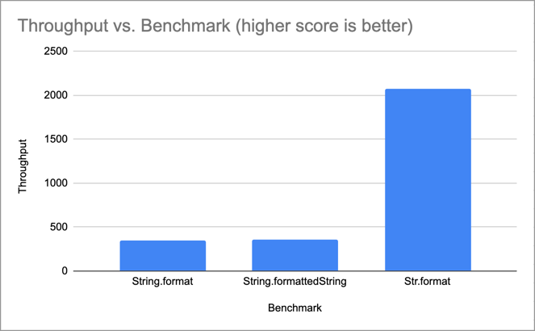

# Str Lib - Fast Java String Formatting

## Quick Example

Str Lib gives you fast and easy String formatting via the `Str.format()` method:

```java
Str.format("User ID: {}", userId);
```

We use the same formatting rules as `Log4J` / `SLF4J`,
so you should rarely need to mix format styles:

```java
// Example - mixed String format styles can be annoying.
private static final String EXCEPTION_LOG_FMT = "Exception: {}"; // For logging.
private static final String EXCEPTION_STR_FMT = "Exception: %s"; // Then another for String.format() !
```

## Really Fast

Best of all, `Str.format()` is benchmarked at [_over 6x faster_](https://docs.google.com/spreadsheets/d/1JRzrd1Zg731FyFR1mDesbG92YXBgDZcpPaMTyMu6v7s/edit?usp=sharing) than using `String.format()`.



### Other Nice Things

- No transitive dependencies
- Tiny lib size - under 6k
- Works with Java 8+
- Apache 2.0 License

## How To Use

### Maven

```xml
<!-- https://mvnrepository.com/artifact/com.terheyden/strlib -->
<dependency>
    <groupId>com.terheyden</groupId>
    <artifactId>strlib</artifactId>
    <version>0.0.2</version>
</dependency>
```

### Gradle

```groovy
// https://mvnrepository.com/artifact/com.terheyden/strlib
implementation group: 'com.terheyden', name: 'strlib', version: '0.0.2'
```

## Details

### _How does `Str.format()` handle nulls?_

`Str.format()` simply outputs `null` for null parameters, e.g.:

```java
Str.format("User name: {}", null); // "User name: null"
```

### _How are too few parameters handled?_

Parsing simply stops when there are no more parameters. For example:

```java
Str.format("{} and {} and {}", "one", "two"); // "one and two and {}"
```

### _How are too many parameters handled?_

It's important that you not lose any data, so extra parameters are simply appended to the end of
the String, separated by a space, e.g.:

```java
Str.format("Numbers:", 1, 2, 3); // "Numbers:1 2 3"
```
